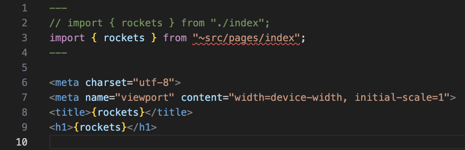

# withastro language-tools issue 584 repro repo

A repro repo for https://github.com/withastro/language-tools/issues/584

## Steps to reproduce

1. Install the [VS Code extension](https://marketplace.visualstudio.com/items?itemName=astro-build.astro-vscode)
2. Clone this repo.
3. Install dependencies: `npm i`.
4. Observe the error in VS Code.
5. Run `npx astro check` to see it produces no errors or warnings.
6. Run to see it builds without errors:

```sh
npx astro build && npx astro preview
```

## Screenshot


